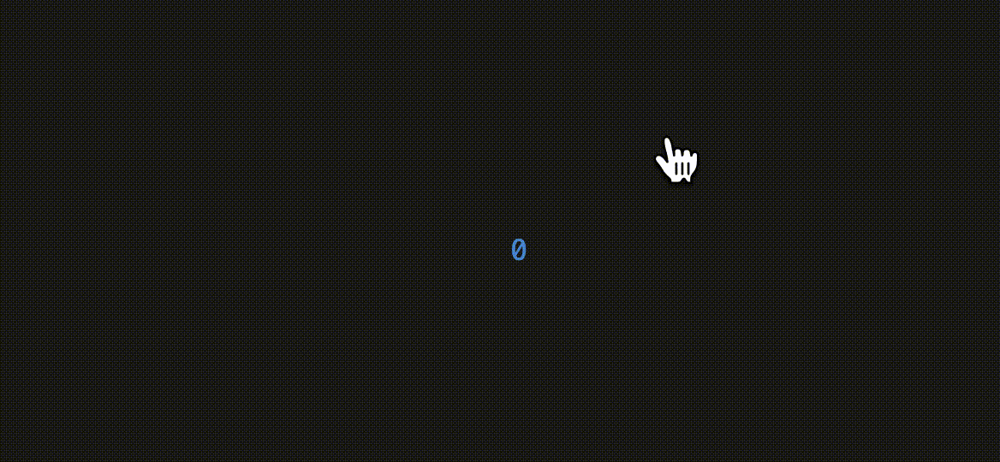

## tdom

### Usage
```tsx
import { useState } from "react";
import { Document } from "../element.js";
import { createRoot } from "../react-tdom/index.js";

function App() {
  const [count, setCount] = useState(0);
  return (
    <box
      style={{
        height: "100%",
        width: "100%",
        justifyContent: "center",
        alignItems: "center",
        color: count % 2 ? "red" : "blue",
      }}
      onMouseDown={() => setCount(count + 1)}
    >
      {count}
    </box>
  );
}

const doc = new Document(process.stdin, process.stdout);
createRoot(doc.root).render(<App />);
```

